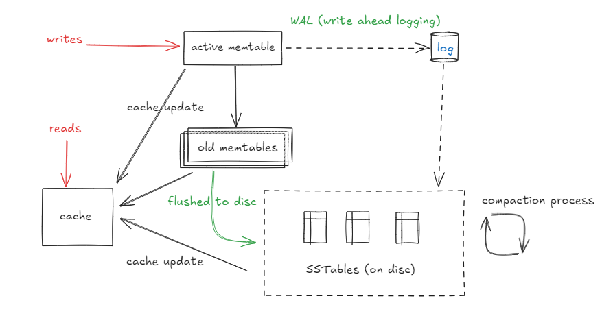

# Design Specs

## Basic Objects 
`Node`
```
{
    "data_pointer": "uuid_0x000fffe356",
    "connection_list": SortedSet([
        "node_class.node_id",
        ...
    ]),
    ...
}
```

`Data Block` Table
```
{
    "uuid_0x...": "raw_data",
    ...
}
```

`Reads Cache`
```
{
    "node_class.node_id": "Node Object<>",
    ...
}
```

## Architecture


## Flow
+ Writes
  + all writes go to an active memtable.
  + when a function value crosses threshold, dump it to old_memtables. 
    function(size, keys, ...).
    old_memtables = list[memtables]
  + flush to disc as memtables cross a theshold function
    function(size, tables, keys, ...).
  + merge SSTables, as a batch process. (to be detailed later)
  + all writes are flushed to buffer. 
    async batch buffer data to logs on disc.
  + if a write happens to an active memtable. invalidate cache entry.
+ Reads
  + direct reads to cache. 
  + cache is simply a swap space.
  + cache is not updated like active memtable. queries are cached, and swapped in from disc.

## Directory Structure
```
lib/
├── core/
│   ├── sstable.cpp
│   ├── memtable.cpp
│   ├── merge_log.cpp
│   ├── compaction_manager.cpp
│   ├── cache.cpp
│   └── utils.cpp
├── index/
│   ├── node_data_index.cpp
├── concurrency/
│   ├── thread_pool.cpp
│   └── lock_manager.cpp
├── persistence/
│   ├── flushing_manager.cpp
│   └── durability_manager.cpp
├── plugins/
│   ├── plugin_interface.h
│   └── example_plugin.cpp
├── storage_engine.h
├── storage_engine.cpp
└── config.json
```